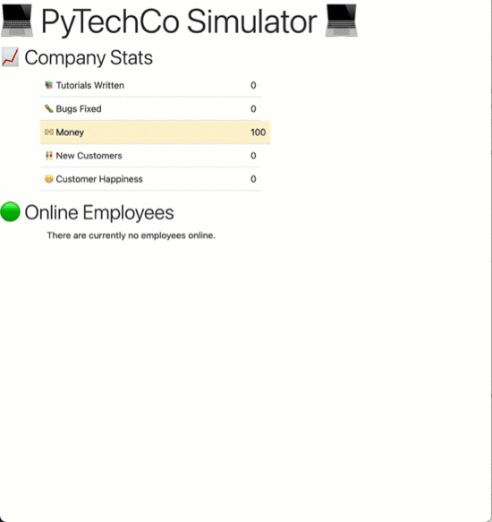

# PyTechCo Simulator

This is a companion repository for the [Get Started with Nomad](https://github.com/hashicorp-education/learn-nomad-getting-started) collection. It contains the source code for the example application used in that collection.

A tech company simulator similar to [John Conway's Game of Life](https://en.wikipedia.org/wiki/Conway%27s_Game_of_Life) in that it requires no interaction from the user.

Once set up, employees come online to work on their tasks and log off once complete.

These tasks generate resources for the company that are shown in the company stats section.

New employees will come online only if there is enough `money` to cover their salary.

## Components

There are four components to the simulator: 
- A Redis database holds the resource counts and employee data including their status (online or offline).
- A Flask webapp that shows company resources and information about employees. It automatically refreshes the page.
- A setup script that seeds the database with resources and sets their counts to zero.
- An employee script that brings an employee online, works on tasks, and takes the employee offline when complete. Resources from the tasks are sent to the database.